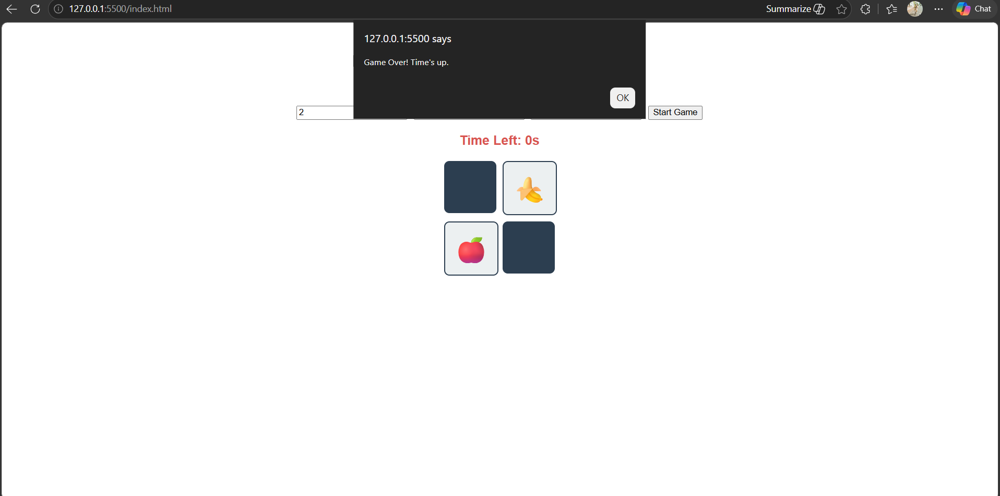
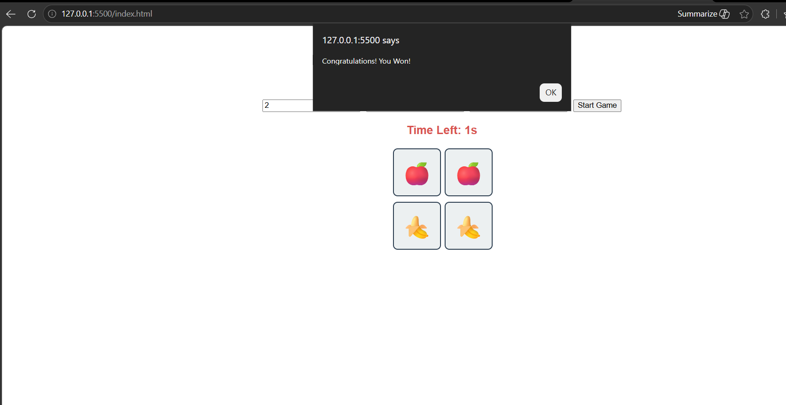

# Memory-scramble-game
Software Construction Tools Memory Scramble Game Task

# 🧠 Memory Scramble Game

A polished, web-based memory card game developed as part of **SE606 Software Construction** coursework (Task-4). The project demonstrates the practical application of software construction tools, configuration management, and **Asynchronous Programming / Concurrency Concepts**.

🌐 **Play the Game Live Here:** [https://shahd77fayez.github.io/Memory-scramble-game/]

---

## 📋 Table of Contents
- [Game Requirements & Features](#-game-requirements--features)
- [How to Build & Run](#%ufe0f-how-to-build--run)
- [Architecture & Concurrency Implementation](#-architecture--concurrency-implementation)
- [Project Structure](#-project-structure)
- [Git Configuration Management](#-git-configuration-management)
- [Screenshots](#-screenshots)
- [Team Members](#-team-members)

---

## 🎯 Game Requirements & Features

The game strictly implements all requirements outlined in the task specification:
- **Dynamic Board Grid:** Allows players to configure custom board sizes using `nRows` and `nColumns`. The system automatically validates that the total `board_size` is an **even number**.
- **Randomized Distribution:** Dynamically generates `board_size / 2` unique shapes/emojis and randomly distributes (shuffles) them across the board cells.
- **Asynchronous Countdown Timer:** Features a real-time countdown clock displayed on-screen based on the player's configured timeout setting.
- **State Management:** - Flipping two cards displays their hidden shapes.
  - Correctly matched pairs remain face-up.
  - Incorrect matches automatically flip back after a brief, non-blocking delay.
- **Game-Over Triggers:** Displays a clear game-over state if the countdown timer reaches zero before all card pairs are successfully matched.

---

## ⚙️ How to Build & Run

Since the application is built entirely with native web technologies (HTML5, CSS3, Modern JavaScript), it requires no complex compilation or external dependencies.

### Local Execution:
1. Clone the repository:
   ```bash
   git clone [https://github.com/shahd77fayez/Memory-scramble-game](https://github.com/shahd77fayez/Memory-scramble-game)
2. Navigate to the project directory and open index.html directly in any modern web browser (Chrome, Firefox, Edge, Safari).
3. Alternatively, run it using the Live Server extension in VS Code for hot-reloading capability.

---

## ⚡ Architecture & Concurrency Implementation

The core backend logic is engineered around the asynchronous concepts

1. Asynchronous Computation & The Event Loop

    Instead of blocking the browser environment using a synchronous sleep cycle (which would freeze the UI and make cards unclickable), the countdown timer utilizes a JavaScript Promise and setInterval within an async execution block:

    ```bash 
        function startGameTimer(seconds) {
            return new Promise((resolve, reject) => { ... });
        }
    ```

    Using the await keyword, the master game routine delegates execution gracefully to the browser's Event Loop, ensuring the user interface remains fully interactive while time elapses in parallel.

2. Race Condition Prevention (Shared Memory Lock)

    In a concurrent UI environment, a rapid sequence of user interactions can trigger an unstable state (e.g., clicking a 3rd or 4th card before the first mismatched pair finishes flipping back). This is a classic Race Condition where the program's correctness depends on relative input timing.

    We successfully neutralized this bug by implementing a state-based lock mechanism (lockBoard):

    ```bash
    if (lockBoard) return;
    ```
    This forces atomic step resolution, ensuring that matching operations complete deterministically without interleaving issues.

---

## 📂 Project Structure

    ├── Images          # screenshoots of demo
        ├── Fail_try.png
        ├── Success.png 
    ├── game.js         # Core Game loop, asynchronous timer, and matching logic
    ├── index.css       # styling layout, inputs , cards     
    ├── index.html      # Game UI layout, configuration inputs      
    └── README.md       # Project documentation and architectural explanation
    
---

## 🛠️ Git Configuration Management

In accordance with best configuration management practices, development was carried out incrementally using meaningful, granular commits rather than a single monolithic push:

- feat: create basic HTML structure, styling, and input validation for board size

- feat: generate shuffled card pairs and render grid dynamically

- feat: implement card flipping and matching logic

- feat: implement asynchronous countdown timer using Promises and async/await

---

## 📸 Screenshots
In case time out and didn't finsih matching 



In case finish before time 


----
Developed as part of the Software Construction Syllabus - Faculty of Computers and Information, Cairo University.
